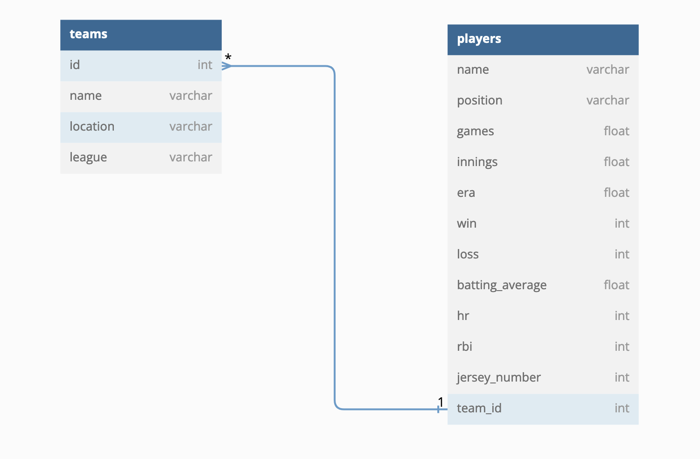

# phase-3-sinatra-react-project: ⚾️ MLB All-Stars ⚾️

## Overview
This application connnects a Javascript-React application with a Ruby-Sinatra database. Users can explore a generated database of MLB teams and players. Users may interact with the list of content rendered and Post, Patch, and Delete as they wish. 

**LINK:** https://github.com/ChristopherAPerez/phase-3-sinatra-react-project

**LIVE LINK:** https://youtu.be/f1H_36bfVq4

### Model: One-to-Many

 

## How to Run/Installation

#### Install

Clone the repository

```console
git clone git@github.com:juliendargelos/project.git
```

Then, `cd` phase-3-sinatra-react-project

#### Frontend Setup

To get started, `cd` into the `my-app-frontend` directory. Then run:

```console
$ npm install
```

After, start the react-app:

```console
$ npm start
```

#### Backend Setup

In another terminal, `cd` into the `my-app-backend` directory, and run `bundle install` to install the dependencies.

```console
$ bundle install
```

You can check which and make sure  gems are installed.

```console
$ gem list
```

After, run the migrations and use the provided seeds.rb file to `seed` the database. This will provide data for the application.
```console
$ bundle exec rake db:migrate db:seed
```

Finally, you can start your server with with `bundle exec rake server`.

```console
$ bundle exec rake server
```


## Resources

- [create-react-app][]
- [dbdiagram.io][]
- [Postman][postman download]

[create-react-app]: https://create-react-app.dev/docs/getting-started
[create repo]: https://docs.github.com/en/get-started/quickstart/create-a-repo
[dbdiagram.io]: https://dbdiagram.io/
[postman download]: https://www.postman.com/downloads/

## Authors and acknowledgment
All images used in this application belong rightfully to Official MLB and the their respectful artists.